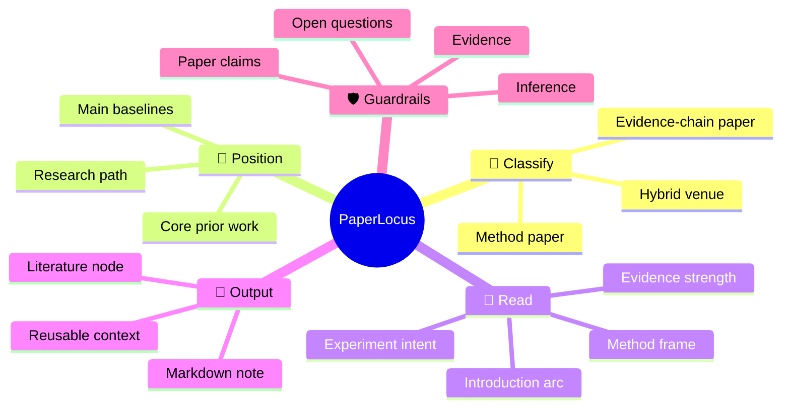
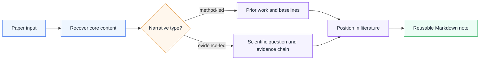

<h1 align="center">PaperLocus</h1>

<p align="center">
  <strong>Locate every paper in the literature, not just in a summary.</strong>
</p>

<p align="center">
  Reference-aware paper reading for Codex. PaperLocus classifies papers by narrative logic, places them in the literature, and turns them into reusable Markdown notes.
</p>

<p align="center">
  <a href="./LICENSE"></a>
  
  
  
  
</p>

<p align="center">
  <strong>Compass points:</strong>
  🧭 position · 🔎 compare · 🧩 classify · 📝 note · 🛡️ verify
</p>

## What It Does

`PaperLocus` is a Codex skill for reading research papers the way researchers actually use them:

- locate a paper in the literature
- compare it against core prior works and baselines
- classify whether it is a method paper or an evidence-chain science paper
- produce reusable Markdown notes for later retrieval, review, and discussion

It is especially useful when you move between:

- `ccf-a / arXiv` method papers
- `Nature / Science / Nature-*` papers
- hybrid science-venue papers whose actual narrative is still method-led

## Why It Exists

Most paper-reading tools answer surface questions:

- what is the paper about
- what method does it use
- what are the results

PaperLocus is built for the questions that matter once you are actually doing research:

- what line of work does this paper belong to
- which prior work does it inherit from
- what exactly did it change
- which baseline or reference paper is it really arguing with
- where does this paper sit in the research landscape

## Mental Model



## Reading Pipeline



## At A Glance

|  | Capability | What it means |
| --- | --- | --- |
| 🧩 | Narrative-aware classification | Classifies papers by structure and argument, not venue alone |
| 🔎 | Reference-aware reading | Prioritizes introduction-critical papers and dominant baselines |
| 📝 | Reusable Markdown notes | Produces durable notes for Obsidian, RAG, and long-running literature workflows |
| 🛡️ | Research hallucination control | Separates paper claims, evidence, inference, and open questions |

## Supported Inputs

PaperLocus is designed to work with:

- PDF
- local files
- arXiv links
- DOI links
- webpages
- screenshots
- title-only requests

Input handling is intentionally different by source:

|  | Input | Behavior |
| --- | --- | --- |
| 📄 | PDF or local file | Extract title, abstract, section headers, introduction, method, experiments, and conclusion first |
| 🔗 | arXiv, DOI, or webpage | Recover metadata and primary paper text or abstract before summarizing |
| 🖼️ | Screenshot | Treat as partial evidence and avoid whole-paper claims |
| 🏷️ | Title only | Recover abstract-level context first, then downgrade to triage if full text is unavailable |

## Classification Logic

PaperLocus uses narrative logic instead of venue heuristics.

### Method-paper signals

- the abstract is about a new model, algorithm, benchmark, or training recipe
- the structure looks like `introduction -> related work -> method -> experiments`
- the main evidence is benchmark comparison, ablation, or scaling
- the contribution is framed as `we propose`

### Science evidence-chain signals

- the abstract is about a scientific finding, mechanism, or claim about the world
- the structure is driven by findings and supporting evidence
- the paper is organized around a scientific question or competing explanations
- the contribution is framed as `we find`, `we reveal`, or `we show that`

### Mixed-case rule

If the venue suggests one branch but the narrative suggests another, PaperLocus follows the narrative and explicitly notes the conflict.

## Validation Set

The current version has been stress-tested on three groups:

|  | Group | Examples | Expected behavior |
| --- | --- | --- | --- |
| 🧪 | Science venue, method-led | `scBERT`, `scGPT`, `Geneformer`, `scLong` | Treat as method-led papers |
| 🔭 | Classical evidence-chain papers | `A kilonova as the electromagnetic counterpart to a gravitational-wave source`, `A formal test of the theory of universal common ancestry` | Treat as science evidence-chain papers |
| 🤖 | arXiv and embodied-AI papers | `DiT`, `Unified World Models`, `Motus`, `LDA-1B`, `DINOv3` | Treat as method papers and emphasize literature positioning |

## Installation

Copy the skill folder into your Codex skills directory:

```bash
mkdir -p ~/.codex/skills
cp -r paperlocus ~/.codex/skills/
```

On Windows PowerShell:

```powershell
New-Item -ItemType Directory -Force $HOME\.codex\skills | Out-Null
Copy-Item -Recurse .\paperlocus $HOME\.codex\skills\
```

## Optional Runtime Dependencies

The skill itself is Markdown-only, but it works best with:

- PDF reading support through `pypdf` or `pdfplumber`
- a PDF-focused helper skill for page-level inspection
- web access for DOI, arXiv, and webpage recovery

## Example Prompts

```text
Use $paperlocus to read this PDF and produce a structured Chinese reading note.
```

```text
Use $paperlocus to decide whether this Nature paper should be treated as a method paper or as an evidence-chain paper.
```

```text
Use $paperlocus to explain this paper in relation to the core prior works criticized in the introduction.
```

More prompt examples are available in [examples/sample-prompts.md](examples/sample-prompts.md).

## Output Style

The default output is a compact whole-paper note with sections such as:

- one-sentence summary
- paper card
- paper type
- position in the literature
- introduction arc or scientific question
- method frame
- experiment design and core results
- main contributions
- limitations, counterexamples, and checks
- sections worth close reading

A compact sample output is available in [examples/sample-output.md](examples/sample-output.md).

## Repository Layout

```text
paperlocus/
  README.md
  examples/
    sample-prompts.md
    sample-output.md
  paperlocus/
    SKILL.md
    agents/
      openai.yaml
    references/
      paper_type_examples.md
```

## Release Copy

- Repository description: `Reference-aware paper reading for Codex that classifies research papers by narrative logic, positions them in the literature, and turns them into reusable Markdown notes.`
- Tagline: `Locate every paper in the literature, not just in a summary.`
- First release: `v0.1.0 - Initial public release`

## License

Released under the [MIT License](./LICENSE).
