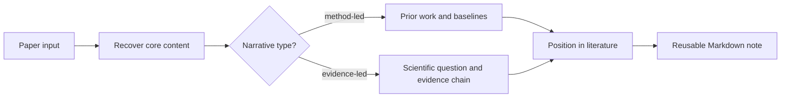

# PaperLocus

> Locate every paper in the literature, not just in a summary.

PaperLocus is a Codex skill for reference-aware paper reading. It classifies
research papers by narrative logic, places them in the literature, and turns
them into reusable Markdown notes.

## What It Does

PaperLocus is designed for the questions researchers ask after the abstract:

- What line of work does this paper belong to?
- Which prior works or baselines is it really arguing with?
- Is this a method paper, an evidence-chain science paper, or a mixed case?
- What should I remember as a reusable literature note?
- Which claims are supported by the paper, and which parts are inference?

It is especially useful when moving between:

- `ccf-a / arXiv` method papers
- `Nature / Science / Nature-*` papers
- science-venue papers whose actual narrative is still method-led

## Quick Start

### 1. Install The Skill

Copy the skill folder into your Codex skills directory.

```bash
mkdir -p ~/.codex/skills
cp -R paperlocus ~/.codex/skills/
```

On Windows PowerShell:

```powershell
New-Item -ItemType Directory -Force $HOME\.codex\skills | Out-Null
Copy-Item -Recurse -Force .\paperlocus $HOME\.codex\skills\
```

After installation, start a new Codex session or run `codex exec` with a prompt
that explicitly mentions `$paperlocus`.

### 2. Run A Small Smoke Test First

Before trying a long PDF, verify that Codex can see the skill and can write a
note. A title-only or abstract-only test is the fastest path.

Interactive prompt:

```text
Use $paperlocus to read the title-only paper request: Attention Is All You Need.
Do not browse. Create a concise Chinese reusable Markdown note.
Clearly mark the note as title-only and separate paper claims, inference, and uncertainty.
```

CLI smoke test:

```bash
codex exec -c 'model_reasoning_effort="low"' --skip-git-repo-check 'Use $paperlocus to read the title-only paper request: Attention Is All You Need. Do not browse. Create a concise Chinese reusable Markdown note as trial-note.md. Clearly mark the note as title-only and separate paper claims, inference, and uncertainty.'
```

On Windows, use `codex.cmd` instead of `codex`:

```powershell
codex.cmd exec -c 'model_reasoning_effort="low"' --skip-git-repo-check 'Use $paperlocus to read the title-only paper request: Attention Is All You Need. Do not browse. Create a concise Chinese reusable Markdown note as trial-note.md. Clearly mark the note as title-only and separate paper claims, inference, and uncertainty.'
```

Why `low` for the first test? In a real first-time trial, high reasoning effort
was overkill for smoke testing and could make the command feel stuck. Use low
reasoning to test installation; use higher reasoning for actual deep reading.

### 3. Read A Paper

Once the smoke test works, give PaperLocus a PDF, arXiv link, DOI, webpage, or
paper title.

```text
Use $paperlocus to read ./paper.pdf and produce a structured Chinese Markdown note.
First recover the title, abstract, section headings, introduction, method, experiments, and conclusion.
If any section is unavailable or extraction is noisy, say so explicitly before making strong claims.
```

For long PDFs, a staged prompt is often better:

```text
Use $paperlocus to make an initial triage note for ./paper.pdf.
Extract the title, abstract, section headings, and conclusion first.
Then classify the paper type and list which sections should be read next.
```

## Reading Pipeline



## Supported Inputs

| Input | Behavior |
| --- | --- |
| PDF or local file | Extract title, abstract, section headers, introduction, method, experiments, and conclusion first |
| arXiv, DOI, or webpage | Recover metadata and primary paper text or abstract before summarizing |
| Screenshot | Treat as partial evidence and avoid whole-paper claims |
| Title only | Recover abstract-level context if possible; otherwise produce a scoped triage note |

## Classification Logic

PaperLocus follows narrative logic instead of venue heuristics.

Prefer the method-paper branch when the abstract centers on a new model,
algorithm, benchmark, or training recipe, and the evidence is mainly baseline
comparison, ablation, scaling, or benchmark metrics.

Prefer the evidence-chain science branch when the abstract centers on a
scientific finding, mechanism, or empirical claim about the world, and the paper
is organized around observations or experiments supporting a central conclusion.

If the venue suggests one branch but the narrative suggests another, PaperLocus
follows the narrative and explicitly notes the conflict.

## Output Style

The default output is a compact whole-paper note with sections such as:

- one-sentence summary
- paper card
- paper type
- position in the literature
- introduction arc or scientific question
- method frame
- experiment design and core results
- main contributions
- limitations, counterexamples, and checks
- sections worth close reading

See [examples/sample-output.md](examples/sample-output.md) for a smoke-test
output and [examples/sample-prompts.md](examples/sample-prompts.md) for more
prompt patterns.

## Practical Notes

- The skill itself is Markdown-only, but PDF reading works best when your Codex
  environment has `pypdf` or `pdfplumber` available.
- On Windows, prefer `codex.cmd` when PowerShell blocks npm `.ps1` wrappers.
- Some Windows Conda setups print noisy activation errors during shell calls.
  If the Markdown output file is valid UTF-8, those warnings may be terminal
  noise rather than a failed PaperLocus run.
- Start small, verify the skill is visible, then move to deep PDF reading.

## Repository Layout

```text
paperlocus/
  README.md
  examples/
    sample-prompts.md
    sample-output.md
  paperlocus/
    SKILL.md
    agents/
      openai.yaml
    references/
      paper_type_examples.md
```

## Release Copy

- Repository description: `Reference-aware paper reading for Codex that classifies research papers by narrative logic, positions them in the literature, and turns them into reusable Markdown notes.`
- Tagline: `Locate every paper in the literature, not just in a summary.`
- First release: `v0.1.0 - Initial public release`

## License

Released under the [MIT License](./LICENSE).
