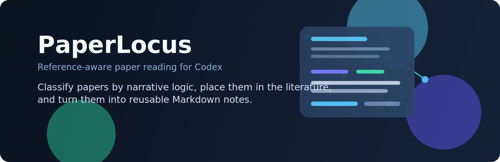
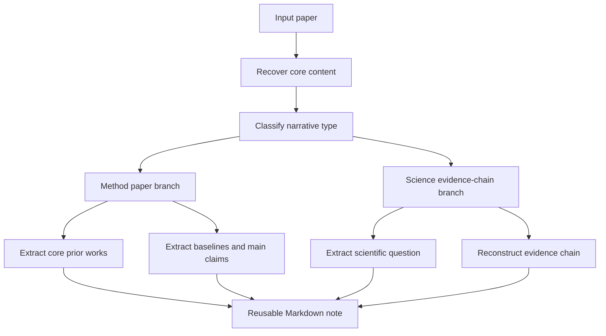
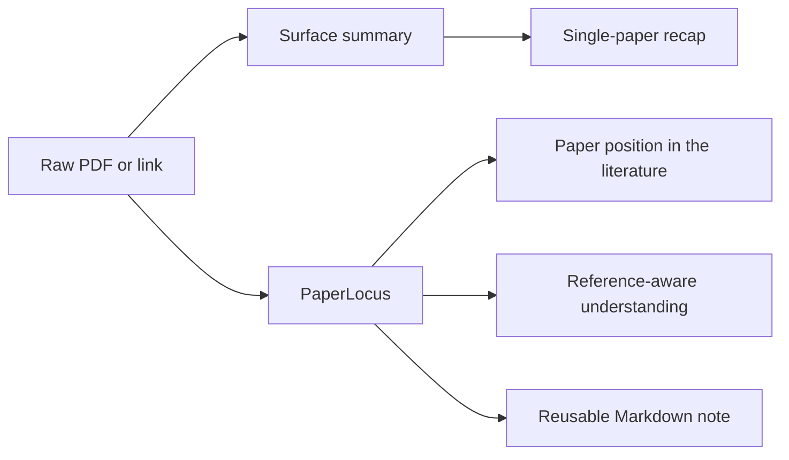

<p align="center">
  
</p>

<p align="center">
  <strong>Reference-aware paper reading for Codex.</strong><br />
  Classify papers by narrative logic, place them in the literature, and turn them into reusable Markdown notes.
</p>

<p align="center">
  <a href="./LICENSE"></a>
  
  
  
</p>

## What It Is

`PaperLocus` is a Codex skill for reading research papers the way researchers actually use them:

- not just summarizing a paper in isolation
- but locating it in the literature
- comparing it against the core prior works and baselines
- and turning the result into reusable Markdown notes

It is designed for users who switch between:

- `ccf-a / arXiv` method papers
- `Nature / Science / Nature-*` papers
- hybrid papers that look like method papers even when they are published in science venues

## Why It Exists

Most paper-reading tools stop at surface summarization:

- what is the paper about
- what method does it use
- what are the results

What often matters more in actual research work is:

- what line of work this paper belongs to
- which prior work it inherits from
- what exactly it changes
- which baseline or reference paper it is really arguing with
- whether it should be read as a method paper or as a scientific evidence-chain paper

`PaperLocus` is built for those questions.

## At A Glance

| Capability | What it means |
| --- | --- |
| Narrative-aware classification | Distinguishes `method papers` from `science evidence-chain papers` by structure, not venue alone |
| Reference-aware understanding | Reads a paper together with its core prior works and dominant baselines |
| Reusable Markdown output | Produces notes that fit Obsidian, RAG, and long-running literature workflows |
| Better research hallucination control | Tries to prevent factual fabrication, bad field positioning, and misleading compression |

## The Core Idea



## What Makes It Different



## Supported Inputs

PaperLocus is designed to work with:

- PDF
- local files
- arXiv links
- DOI links
- webpages
- screenshots
- title-only requests

It does not treat these inputs equally.

- `PDF / local file`
  - extract title, abstract, section headers, introduction, method, experiments, and conclusion
  - skip acknowledgments, checklists, and boilerplate by default
- `arXiv / DOI / webpage`
  - recover metadata and paper text or abstract first
  - prefer the paper itself over third-party commentary
- `screenshot`
  - treat as partial evidence only
  - do not pretend to understand the whole paper from a fragment
- `title only`
  - recover abstract-level context first
  - downgrade to a triage note if the paper cannot be recovered

## Classification Logic

PaperLocus uses narrative logic instead of venue heuristics.

### Method-paper signals

- the abstract is about a new model, algorithm, benchmark, or training recipe
- the structure looks like `introduction -> related work -> method -> experiments`
- the main evidence is benchmark comparison, ablation, or scaling
- the contribution is framed as `we propose`

### Science evidence-chain signals

- the abstract is about a scientific finding, mechanism, or claim about the world
- the structure is driven by findings and supporting evidence
- the paper is organized around a scientific question or competing explanations
- the contribution is framed as `we find`, `we reveal`, or `we show that`

### Mixed-case rule

If the venue suggests one branch but the narrative suggests another, PaperLocus follows the narrative and explicitly notes the conflict.

## Validation

The current version has been manually stress-tested on three useful groups:

### Science-venue but method-led papers

- `scBERT`
- `scGPT`
- `Transfer learning enables predictions in network biology`
- `scLong`

Expected behavior:

- classify them as method-led papers
- not as classical evidence-chain science papers

### Classical evidence-chain papers

- `A kilonova as the electromagnetic counterpart to a gravitational-wave source`
- `A formal test of the theory of universal common ancestry`

Expected behavior:

- classify them into the `Nature / Science` evidence-chain branch

### Local arXiv and embodied-AI papers

- `Scalable Diffusion Models with Transformers`
- `Unified World Models`
- `Motus`
- `LDA-1B`
- `DINOv3`

Expected behavior:

- classify them as method papers
- emphasize prior-work positioning and baseline structure

## Installation

Copy the skill folder into your Codex skills directory.

### macOS / Linux

```bash
mkdir -p ~/.codex/skills
cp -r paperlocus ~/.codex/skills/
```

### Windows PowerShell

```powershell
New-Item -ItemType Directory -Force $HOME\.codex\skills | Out-Null
Copy-Item -Recurse .\paperlocus $HOME\.codex\skills\
```

## Optional Runtime Dependencies

The skill itself is Markdown-only, but it works best with these optional capabilities:

- PDF reading support
  - `pypdf`
  - `pdfplumber`
- a PDF-focused helper skill for page-level inspection
- web access for DOI, arXiv, and webpage recovery

## Example Prompts

```text
Use $paperlocus to read this PDF and produce a structured Chinese reading note.
```

```text
Use $paperlocus to decide whether this Nature paper should be treated as a method paper or as an evidence-chain paper.
```

```text
Use $paperlocus to explain this paper in relation to the core prior works criticized in the introduction.
```

More prompt examples are available in [examples/sample-prompts.md](examples/sample-prompts.md).

## Output Style

The default output is a compact whole-paper note with sections such as:

- one-sentence summary
- paper card
- paper type
- position in the literature
- introduction arc or scientific question
- method frame
- experiment design and core results
- main contributions
- limitations, counterexamples, and checks
- sections worth close reading

A compact sample output is available in [examples/sample-output.md](examples/sample-output.md).

## Repository Layout

```text
paperlocus/
  README.md
  assets/
    paperlocus-banner.svg
  examples/
    sample-prompts.md
    sample-output.md
  paperlocus/
    SKILL.md
    agents/
      openai.yaml
    references/
      paper_type_examples.md
```

## Best Use Cases

- weekly paper reading
- group meeting preparation
- structured literature reviews
- building a long-running Markdown note base
- comparing a new paper against the field rather than reading it in isolation

## Design Philosophy

PaperLocus is optimized for:

- high-quality context, not maximum context
- literature positioning, not just summarization
- reusable notes, not ephemeral chat output
- faithful interpretation, not overconfident compression

## Status

This is an actively iterated research-reading skill. The current emphasis is on:

- better hybrid paper classification
- cleaner reference-aware notes
- stronger support for literature-graph workflows

## License

Released under the [MIT License](./LICENSE).
