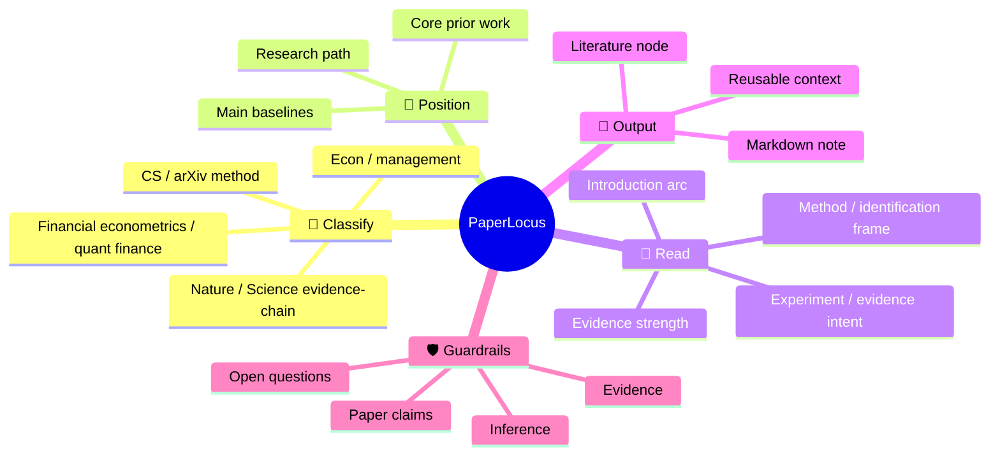
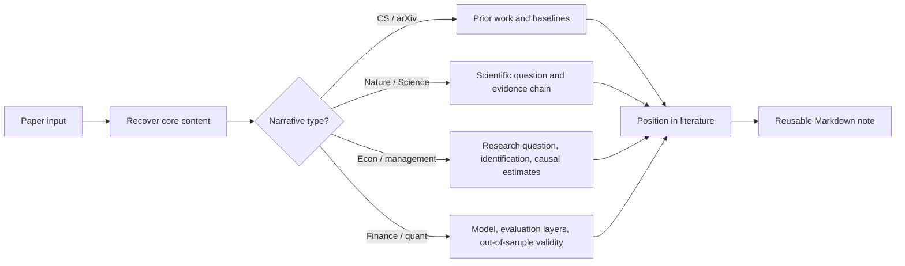

<h1 align="center">PaperLocus</h1>

<p align="center">
  <strong>Locate every paper in the literature, not just in a summary.</strong>
</p>

<p align="center">
  Reference-aware paper reading for Claude Code. PaperLocus classifies papers by narrative logic, places them in the literature, and turns them into reusable Markdown notes.
</p>

<p align="center">
  <a href="./LICENSE"></a>
  
  
  
  
</p>

<p align="center">
  <strong>Compass points:</strong>
  🧭 position · 🔎 compare · 🧩 classify · 📝 note · 🛡️ verify
</p>

## 🎯 What It Does

PaperLocus is designed for the questions researchers ask after the abstract:

- What line of work does this paper belong to?
- Which prior works or baselines is it really arguing with?
- Is this a method paper, an evidence-chain science paper, an economics/management paper, or a financial econometrics/quantitative finance paper?
- What should I remember as a reusable literature note?
- Which claims are supported by the paper, and which parts are inference?

It is especially useful when moving between:

- `ccf-a / arXiv` method papers
- `Nature / Science / Nature-*` papers
- economics and management papers (theory, reduced-form, structural)
- financial econometrics and quantitative finance papers (volatility modeling, asset pricing, portfolio, derivatives, risk management, trading strategies)

## 🚀 Quick Start

### 1. Install The Skill

Copy the skill folder into your Claude Code skills directory.

```bash
mkdir -p ~/.claude/skills
cp -R paperlocus ~/.claude/skills/
```

On Windows PowerShell:

```powershell
New-Item -ItemType Directory -Force $HOME\.claude\skills | Out-Null
Copy-Item -Recurse -Force .\paperlocus $HOME\.claude\skills\
```

After installation, restart Claude Code or start a new session. Invoke the skill with `/paperlocus` or mention `$paperlocus` in a prompt.

### 2. Run A Small Smoke Test First

Before trying a long PDF, verify that the skill is visible.

```text
/paperlocus Read the title-only paper: Attention Is All You Need.
Create a concise Chinese Markdown note. Mark it as title-only
and separate paper claims, inference, and uncertainty.
```

### 3. Read A Paper

Once the smoke test works, give PaperLocus a PDF, arXiv link, DOI, webpage, or paper title.

```text
/paperlocus Read ./paper.pdf and produce a structured Chinese Markdown note.
First recover the title, abstract, section headings, introduction, method,
experiments, and conclusion. If any section is unavailable or extraction is
noisy, say so explicitly.
```

For long PDFs, a staged prompt is often better:

```text
/paperlocus Make an initial triage note for ./paper.pdf.
Extract the title, abstract, section headings, and conclusion first.
Then classify the paper type and list which sections should be read next.
```

## 🧠 Mental Model



## 🧭 Reading Pipeline



## 📥 Supported Inputs

| Input | Behavior |
| --- | --- |
| PDF or local file | Extract title, abstract, section headers, introduction, method, experiments, and conclusion first |
| arXiv, DOI, or webpage | Recover metadata and primary paper text or abstract before summarizing |
| Screenshot | Treat as partial evidence and avoid whole-paper claims |
| Title only | Recover abstract-level context if possible; otherwise produce a scoped triage note |

## 🧩 Classification Logic

PaperLocus follows narrative logic instead of venue heuristics. It classifies papers into four branches:

| Branch | Key Signal | Typical Structure |
| --- | --- | --- |
| **A: CS / arXiv** | New model, algorithm, framework, or benchmark; evidence is baselines and ablations | `intro → related work → method → experiments → conclusion` |
| **B: Nature / Science** | Scientific finding or mechanism; evidence is an accumulated chain supporting a conclusion | organized around findings and evidence, not a standalone method section |
| **C: Econ / management** | Causal question, economic mechanism, or management phenomenon; evidence is regressions and causal estimates | `intro → theory/hypotheses → data → empirical strategy → results → robustness → conclusion` |
| **D: Finance / quant** | Financial model, volatility/risk forecast, factor, derivative pricing, or trading strategy; evidence is model diagnostics, risk backtests, portfolio metrics | `intro → model/method → data → estimation/calibration → evaluation → application` |

If the venue suggests one branch but the narrative suggests another, PaperLocus follows the narrative and explicitly notes the conflict.

## 📝 Output Style

The default output is a compact whole-paper note with sections such as:

**All papers:**
- one-sentence summary
- paper card (authors, year, venue, DOI)
- paper type (branch)
- position in the literature
- research question / introduction arc
- method frame / empirical framework
- core results / main estimates
- main contributions
- limitations, counterexamples, and checks
- sections worth close reading

**Economics / management papers additionally:**
- identification strategy, data & sample, key causal estimates

**Financial econometrics / quant finance papers additionally:**
- model specification, data (frequency, asset, period), competing models, evaluation across statistical/risk/economic dimensions, out-of-sample performance

See [examples/sample-output.md](examples/sample-output.md) for sample outputs across all four branches (CS, Nature/Science, econ/management, finance/quant) and [examples/sample-prompts.md](examples/sample-prompts.md) for prompt patterns.

## 🛠️ Practical Notes

- The skill itself is Markdown-only, but PDF reading works best when your Claude Code environment has `pypdf` or `pdfplumber` available.
- On Windows, prefer `codex.cmd` when PowerShell blocks npm `.ps1` wrappers (for Codex CLI users).
- Some Windows Conda setups print noisy activation errors during shell calls. If the Markdown output file is valid UTF-8, those warnings may be terminal noise rather than a failed PaperLocus run.
- Start small, verify the skill is visible, then move to deep PDF reading.

## 📂 Repository Layout

```text
paperlocus/
  README.md
  release-v0.2.0.md
  examples/
    sample-prompts.md
    sample-output.md
  SKILL.md
  agents/
    openai.yaml
  references/
    paper_type_examples.md
```

## 🚢 Release Copy

- Repository description: `Reference-aware paper reading for Claude Code that classifies research papers by narrative logic (CS, natural science, economics, management, financial econometrics, quantitative finance), positions them in the literature, and turns them into reusable Markdown notes.`
- Tagline: `Locate every paper in the literature, not just in a summary.`
- Current release: `v0.2.0 — Four-branch classification with economics and finance support`

## 📄 License

Released under the [MIT License](./LICENSE).
